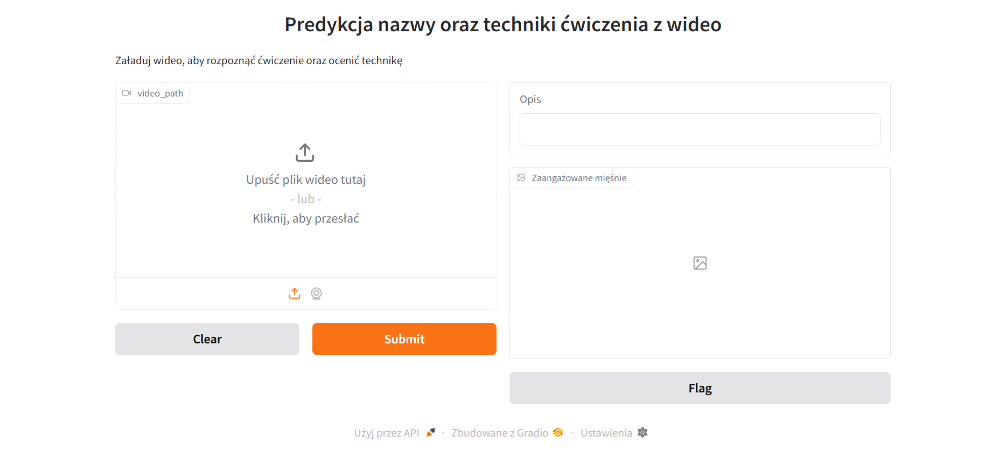
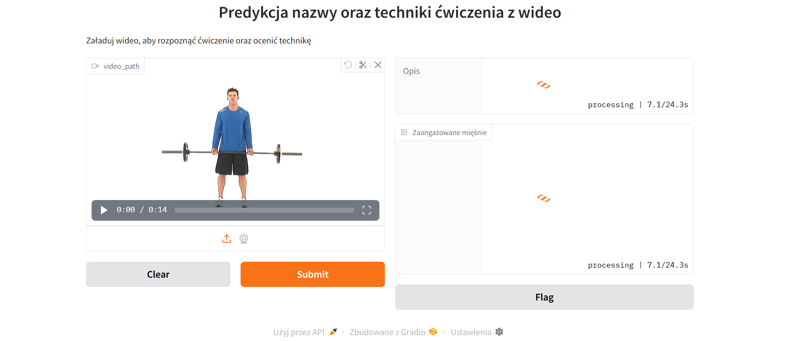
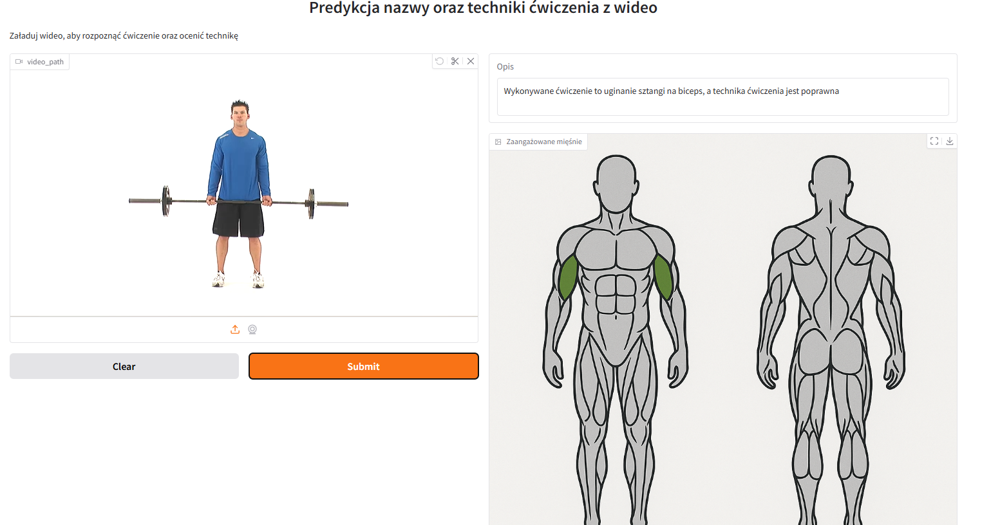

# AI-Gym-Exercise-Analyzer
A deep learning–based application for automatic recognition and technique evaluation of selected gym exercises using user-submitted video recordings. 
The app supports four common exercises:  Squat  Bench Press  Barbell Curl  Push-up
Accepts video input using interface made with gradio
Exercise classification using TensorFlow-based neural networks
Pose estimation and movement tracking via MediaPipe
Technologies Used:
- TensorFlow
- MediaPipe
- OpenCV
The training dataset includes videos:
- Collected from publicly available internet sources
- Recorded manually for this project to improve model accuracy and diversity

1. App Start screen
We can submit video from our desktop

2.Video Processing
Submitted video is being processed by app, we can watch our video also

3. Result
We can see result from app. Predicted exercise and predicten technique.
We can see also on the picture which muscles are being used

